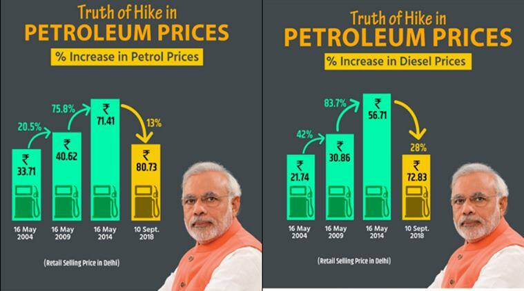
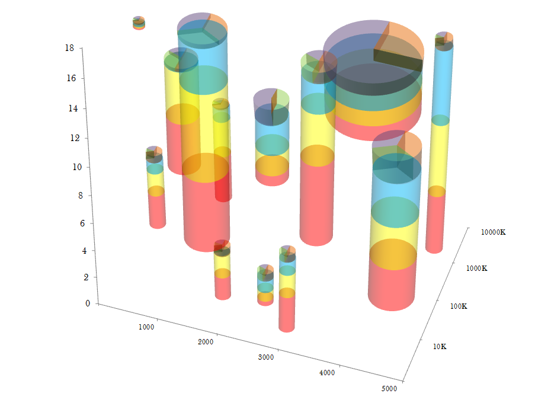
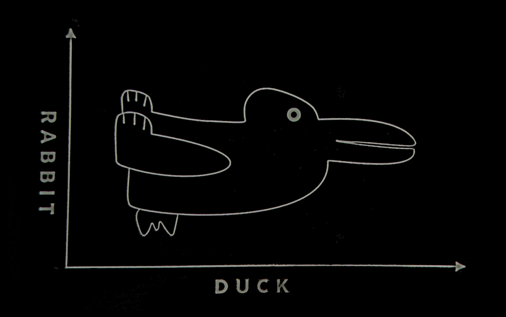

# Identifying the Problem

## Pie Chart Poll Results {.r-fit-text}

::: columns
::: {.column width="40%"}
](starherald_marijuana.png){#fig-neb-mj fig-alt="A newspaper clipping from the Scottsbluff Star-Herald, showing a pie chart of support for the marijuana legalization inititive in Nebraska, from Tuesday, March 16, 2021. The yes slice (which seems to be about 56% of the area) is labeled 44%, while the no slice (which seems to be about 44% of the area) is labeled 56%."}
:::

::: {.column width="5%"}
:::

::: {.column width="55%"}
-   What is wrong with this chart?

-   Do you think it might be misleading? If so, how?

-   Do you think the mistakes were intentional?
:::
:::

## High Support {.r-fit-text}

](americans_marijuana.jpg){#fig-cbs-mj fig-alt="A CBS News pie chart of americans who have tried marijuana, showing 51% today, 43% last year, and 34% in 1997. The chyron below the image says 'High support for legalizing marijuana. More than half of Americans say they've tried pot'"}

-   What is wrong with this chart?

-   What would you change to more accurately represent the data?

-   Do you think the mistakes were intentional?

## Gas Prices {.r-fit-text}

{#fig-gas-india fig-alt="Two bar charts showing the % increase in petrol and diesel prices in India (2018). The first chart shows an increase of 20.5% from 2004 to 2009 (real values of 33.71 to 40.62), an increase of 75.0% from 2009 to 2014 (real values of 40.62 to 71.41), and a 13% decrease from 2014 to 2018 (real values of 71.41 to 80.73). The last bar and arrow are shown in yellow, while the first three bars are shown in green. The second chart shows diesel prices, with real values of 21.74, 30.86, 56.71, and 72.83 in 2004, 2009, 2014, and 2018, respectively. Arrows show the change between each price set, with a 42% increase from 2004 to 2009, an 83.7% increase from 2009 to 2014, and a 28% decrease from 2014 to 2018, which is highlighted in yellow. At the bottom of each chart, an image of Narendra Modi is shown."}

-   What is wrong with this?

-   What design choices contribute to the problems?

-   Do you think this was intentionally designed to be misleading? Why or why not?

## Information Overload {.r-fit-text}

{#fig-stacked-pie}

-   What problems do you have reading this chart?

-   Can you compare the quantities of all 6 variables shown? Why or why not?

(Yes, the blog this chart is taken from is satirical. This is *not* a recommended graphical form.)

# Designing Good Charts

## Why Graphics Matter {.r-fit-text}

Graphics are a form of **external cognition** that allow us to think about the *data* rather than the *chart*.

That is, graphics are a tool to make it easier for us to think about what the data means.

Good graphics take advantage of how the brain works, leveraging

-   preattentive processing

-   perceptual grouping

-   awareness of visual limitations

Good graphics also depend on the data: the chart type should be chosen based on the types of variables you want to display, the amount of data you have, and the results you want to highlight.

## Example: Hertzsprung Russell Diagram {.r-fit-text}

```{r HR-diagram}
#| fig-width: 8
#| fig-height: 5
#| out-width: "100%"
#| message: false
#| warning: false
#| echo: false
#| fig-cap: "The Hertzsprung Russell diagram. Discovered independently by Ejnar Hertzsprung (1873–1967) and Henry Norris Russell (1877–1957). The diagram plots the color index of the star against the brightness (absolute magnitude) of the star. As a result, it is possible to discern that these two variables are related and change together over a star's life cycle: a hypothesis that only came to be because of this chart."
#| fig-alt: "A scatter plot showing the color index of a star on the x-axis and the absolute magnitude (brightness) of the star on the y-axis. Points are colored by spectral class, which varies from blue to white to yellow to red as the color index increases and the star's temperature decreases. Points are primarily located along a downward-sloping line from the top left to the bottom right, which is labeled the 'main sequence'. There is another set of points which diverges from the main sequence and extends out horizontally in the middle of the graph; these are labeled 'giants', and a few outliers that are above the giant cluster are labeled 'supergiants'. Below the main sequence stars, there are outliers which are labeled 'dwarfs'."
#| fig-dpi: 300
if (!file.exists("stars.csv")) download.file("https://raw.githubusercontent.com/astronexus/HYG-Database/main/hyg/v3/hyg_v38.csv", destfile = "stars.csv")
library(magrittr)
library(dplyr)
library(stringr)
library(ggplot2)
stars <- readr::read_csv("stars.csv")

stars <- stars %>%
  mutate(Spectral.Class = str_extract(spect, "^.") %>%
           str_to_upper() %>%
           factor(levels = c("O", "B", "A", "F", "G", "K", "M"), ordered = T),
         EarlyLate = str_extract(spect, ".(\\d)") %>%
           str_replace_all("[^\\d]", "") %>% as.numeric(),
         Temp = 4600*(1/(.92*ci + 1.7) + 1/(.92*ci) + 0.62)) %>%
  filter(!is.na(Spectral.Class) & !is.na(EarlyLate) & !is.na(hip)) %>%
  arrange(Spectral.Class, EarlyLate) %>%
  mutate(SpectralClass2 = paste0(Spectral.Class, EarlyLate) %>% factor(., levels = unique(.)))

ggplot(data = filter(stars, dist < 500)) + 
  # annotate(x = -.25, xend = .75, y = -2, yend = -6.5, arrow = arrow(ends = "both", length = unit(.1, "cm")), geom = "segment", color = "grey") + 
  annotate(x = 0.125, xend = 2, y = 4.25, yend = 4.25, arrow = arrow(ends = "both", length = unit(.1, "cm")), geom = "segment", color = "grey") + 
  geom_point(aes(x = ci, y = -absmag, color = Spectral.Class), alpha = .3) + 
  scale_x_continuous("B-V Color Index", breaks = c(0, .5, 1, 1.5, 2), labels = c("Hot  0.0       ", "0.5", "1.0", "1.5", "           2.0  Cool")) + 
  scale_y_continuous("Absolute Magnitude (Brightness)", breaks = c(-8, -4, 0, 4), labels = c(8, 4, 0, -4)) + 
  scale_color_manual("Spectral\nClass", values = c("#2E478C", "#426DB9", "#B5D7E3", "white", "#FAF685", "#E79027", "#DA281F")) + 
  annotate(x = .25, y = -5.5, label = "Dwarfs", geom = "text", angle = -25, color = "white") + 
  annotate(x = .5, y = -3.75, label = "Main Sequence", geom = "text", angle = -28) + 
  annotate(x = 1.125, y = 0, label = "Giants", geom = "text") + 
  annotate(x = 1, y = 4.5, label = "Supergiants", geom = "text", color = "white") +
  theme(panel.background = element_rect(fill = "#000000"),
        legend.key = element_blank(), 
        panel.grid = element_line(colour = "grey40"),
        axis.text = element_text(color = "white"),
        text = element_text(size = 18, color = "white"), 
        legend.background = element_rect(fill = "#000000"),
        plot.background = element_rect(fill = "#000000")) + 
  ggtitle("Hertzsprung-Russell Diagram") + 
  coord_cartesian(xlim = c(-.25, 2.25), ylim = c(-12, 7)) + 
  guides(color = guide_legend(override.aes = list(alpha = 1)))
```

I've used data from the [HYG Database](https://github.com/astronexus/HYG-Database) to generate this chart. Only stars within 500 AU are shown.

::: notes
John Tukey, a famous statistician often considered the father of statistical graphics, wrote in Exploratory Data Analysis (1977):

> The greatest value of a picture is when it forces us to notice what we never expected to see.

-   What variables are mapped to the following chart dimensions?

    -   X location
    -   Y location
    -   color

-   What other information is present on the chart that is not specifically a data value?

-   What does this chart do well?

-   What design features "work"?

-   What don't you like?
:::

## Preattentive Perception  {.r-fit-text}

-   Combinations of preattentive features require attention

    -   Double-encoding (using multiple features for the same variable) is ok

```{r preattentive1}
#| echo: false
#| fig-width: 4
#| fig-height: 4
#| label: fig-preattentive1
#| fig-cap: "Two scatterplots with one point that is different. Can you easily spot the different point?"
#| fig-subcap: 
#|   - "Shape"
#|   - "Color"
#| layout-ncol: 2

set.seed(153253)
data <- data.frame(expand.grid(x=1:6, y=1:6), color=sample(c(1,2), 36, replace=TRUE))
data$x <- data$x+rnorm(36, 0, .25)
data$y <- data$y+rnorm(36, 0, .25)
suppressWarnings(library(ggplot2))
new_theme_empty <- theme_bw()
new_theme_empty$line <- element_blank()
# new_theme_empty$rect <- element_blank()
new_theme_empty$strip.text <- element_blank()
new_theme_empty$axis.text <- element_blank()
new_theme_empty$plot.title <- element_blank()
new_theme_empty$axis.title <- element_blank()
# new_theme_empty$plot.margin <- structure(c(0, 0, -1, -1), unit = "lines", valid.unit = 3L, class = "unit")

data$shape <- c(rep(2, 15), 1, rep(2,20))
library(scales)
ggplot(data=data, aes(x=x, y=y, color=factor(1, levels=c(1,2)), shape=factor(shape), size=I(5))) + 
  geom_point() +
  scale_shape_manual(guide="none", values=c(19, 15)) + 
  scale_color_discrete(guide="none") + 
  new_theme_empty

data$shape <- c(rep(2, 25), 1, rep(2,10))
ggplot(data=data, aes(x=x, y=y, color=factor(shape), shape=I(19), size=I(5)))+
  geom_point() +  
  scale_color_discrete(guide="none") + 
  new_theme_empty
```

## Preattentive Perception {.r-fit-text}


-   Combinations of preattentive features require attention

    -   Double-encoding (using multiple features for the same variable) is ok
    
```{r preattentive2}
#| echo: false
#| fig-width: 4
#| fig-height: 4
#| label: fig-preattentive2
#| fig-cap: "Two scatterplots. Can you easily spot the different point(s)?"
#| fig-subcap: 
#|   - "Shape and Color (dual encoded)"
#|   - "Shape and Color (different variables)"
#| layout-ncol: 2
set.seed(1532534)
data <- data.frame(expand.grid(x=1:6, y=1:6), color=sample(c(1,2), 36, replace=TRUE))
data$x <- data$x+rnorm(36, 0, .25)
data$y <- data$y+rnorm(36, 0, .25)
suppressWarnings(library(ggplot2))
new_theme_empty <- theme_bw()
new_theme_empty$line <- element_blank()
# new_theme_empty$rect <- element_blank()
new_theme_empty$strip.text <- element_blank()
new_theme_empty$axis.text <- element_blank()
new_theme_empty$plot.title <- element_blank()
new_theme_empty$axis.title <- element_blank()
# new_theme_empty$plot.margin <- structure(c(0, 0, -1, -1), unit = "lines", valid.unit = 3L, class = "unit")

data$shape <- data$color
ggplot(data=data, aes(x=x, y=y, 
                      color=factor(color), 
                      shape=factor(shape))) + 
  geom_point(size = 5) +
  scale_shape_manual(guide="none", values=c(19, 15)) +
  scale_color_discrete(guide="none") + 
  new_theme_empty

data <- data %>%
  mutate(sample = row_number() %in% sample(1:n(), 4)) %>%
  mutate(shape = if_else(sample, if_else(shape == 1, 2, 1), shape))

ggplot(data=data, aes(x=x, y=y, 
                      color=factor(color), 
                      shape=factor(shape))) + 
  geom_point(size = 5) +
  scale_shape_manual(guide="none", values=c(19, 15)) +
  scale_color_discrete(guide="none") + 
  new_theme_empty
# qplot(data=data, x=x, y=y, color=factor(color), shape=factor(shape), size=I(5))+scale_shape_manual(guide="none", values=c(19, 15)) + scale_color_discrete(guide="none") + new_theme_empty
```
## Perceptual Grouping  {.r-fit-text}

::: {layout="[[55,-10,35]]"}
{#fig-rabbitduck fig-alt="A picture laid out on an x-y coordinate axis. The y-axis is labeled 'Rabbit' and the x-axis is labeled 'Duck'. When viewed with the rabbit axis at the bottom, the image looks like a rabbit with tall ears; when viewed with the duck axis at the bottom, the image looks like a duck, where the ears become the bill."}

{#fig-illusory fig-alt="A complex figure that appears to be made up of a black outline of a triangle, three circles laid out to form the points of an inverted triangle, and a white triangle overlaid on top of the three dots. In practice, what actually exists is a set of three angles at 0, 120, and 240 degrees, and a set of three pac-man shapes (circles with a pie slice taken out) at 60, 180, and 300 degrees."}

:::

## Perceptual Grouping {.r-fit-text}

{fig-alt="An image reading 'GESTALT', where each letter demonstrates a principle of gestalt grouping. G has a white stripe over it, demonstrating closure - the stripe and the G are perceived as separate objects. E is shown as a grid of black squares, with grey squares making up the background; this demonstrates proximity - small objects close together are perceived as being part of the same whole. A bar is woven through the S shape, showing good continuation - the S is perceived as a continuous object that is behind the bar in the middle portion. The two Ts are striped and indicate similarity - they are similarly shaped and patterned and can be perceived as a group. The AL are connected, and the inside of the A seems to have a white tree in the middle, demonstrating figure/ground. The final T is part of the similarity group."}

## Grouping in Charts

```{r chart-emphasis-r}
#| label: chart-emphasis-r
#| fig-width: 6
#| fig-height: 4
#| fig-cap: "Three versions of the same data that emphasize different aspects of the dataset."
#| fig-subcap: 
#|   - "Bar chart, showing 5 states"
#|   - "Line chart, with one state per line"
#|   - "Box plot by year, all 50 states"
#| layout-nrow: 3
#| layout-ncol: 1

library(readr)
library(dplyr)
library(tidyr)
library(ggplot2)
library(geomtextpath)
library(stringr)
theme_set(theme_bw())
counties <- read_csv("https://raw.githubusercontent.com/evangambit/JsonOfCounties/master/counties.csv")

popsubset <- counties |> select(name, fips, state, starts_with("population")) |>
  pivot_longer(starts_with("population"), names_to = "year", values_to = "population") |>
  mutate(year = parse_number(year))

state_pop <- popsubset |> group_by(state, year) |>
  summarize(population = sum(population))

pal <- viridis::viridis(10)
state_pop %>%
  filter(state %in% c("NE", "IA", "CO", "MO", "KS")) %>%
  ggplot(aes(x = state, y = population, fill = factor(year))) +
  geom_col(position = "dodge", color = "black") +
  scale_fill_manual("Year", values = pal) +
  scale_x_discrete("State") + 
  ylab("State Population, 2010-2019") + 
  theme(legend.position = c(1, 1), legend.justification = c(.95,.95))
```

```{r}
state_pop |>
  filter(state %in% c("NE", "IA", "CO", "MO", "KS")) |>
  mutate(label = str_replace_all(state, c("NE" = "Nebraska", "IA" = "Iowa", "CO" = "Colorado", "MO" = "Missouri", "KS" = "Kansas"))) |>
  ggplot(aes(x = year, y = population, color = state)) +
  geom_textpath(aes(label = label), text_only = F) + 
  scale_x_continuous("Year", breaks = (1005:1010)*2) + 
  guides(color ="none") + 
  ylab("Population")
```

```{r}
state_pop %>%
  ggplot(aes(x = factor(year), y = population)) +
  geom_boxplot() +
  xlab("Year") + 
  ylab("Population")
```

# Perceptual Limitations

## Color {.r-fit-text}

- 10% of XY  and 0.2% of XX have color deficiency

- Avoid rainbow color schemes
  - unequal perception of different colors (we see more shades of green) = misleading idea of distance
  
  - avoid "stoplight" color schemes
  
## Color {.r-fit-text}
- Strategies
  - double encoding (color + shape or linetype)
  - make it work with black and white printers
  - use monochromatic (single color) gradients where possible
  - if you use bidirectional scale (e.g. blue to red), go through white or light yellow
  

## Color
- Be conscious of what some colors "mean" to use implicit understandings

- Avoid pink = female, blue = male

## Working Memory

- you can remember between 5 and 9 (7 plus or minus 2) things without writing them down

- Avoid legends that have more than 7 categories


## Accessibility {.r-fit-text}

- Provide alt-text for your charts: describe the important information, the data source and how the information is represented

- Use larger text to make it easy for people with vis deficiencies to read

- Some fonts are easier for people with dyslexia to read -- if you're working with someone with dyslexia, ask them what font they prefer.
