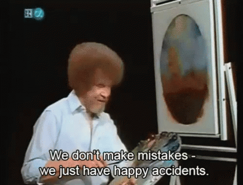
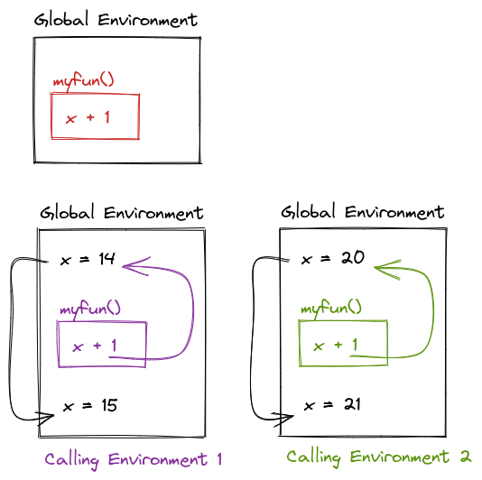
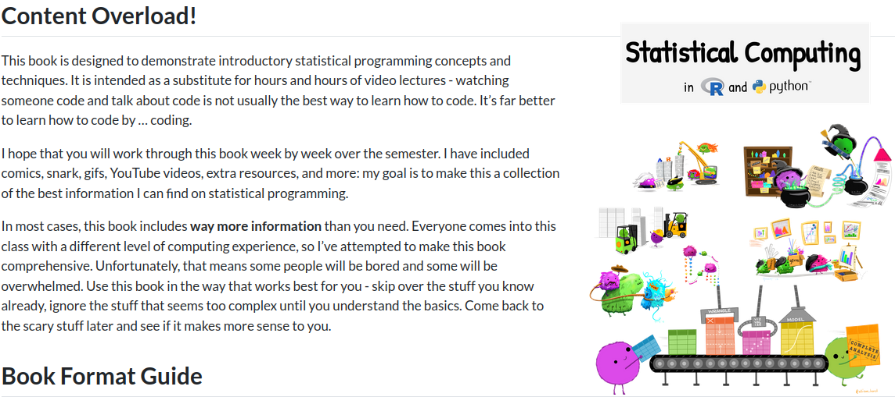
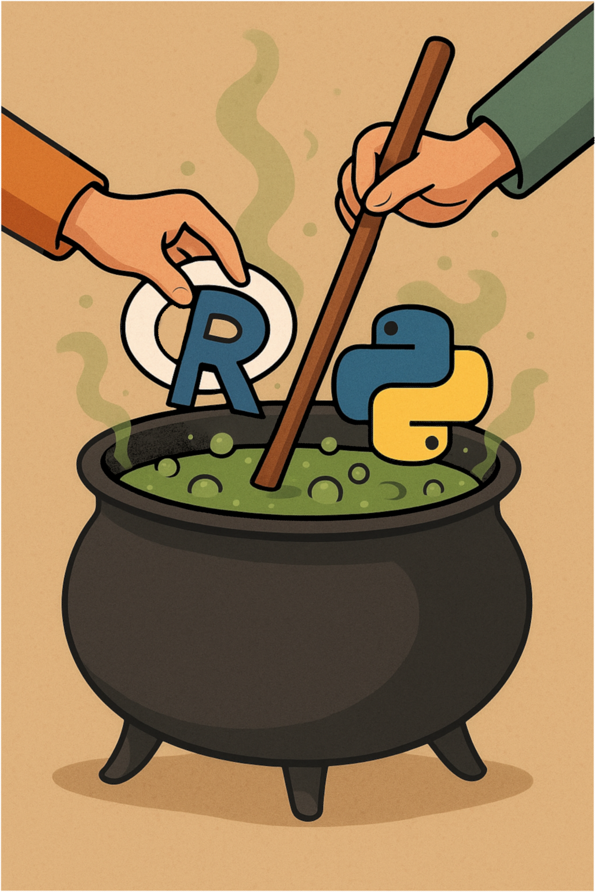

## Outline

::: {.nonincremental}

- How to accidentally write a textbook

- Design Decisions

- Teaching R and Python together

- Conclusions

:::

::: {layout-ncol=2}

::: {.center}


Textbook Link
:::

::: {.center}


Slides Link
:::

:::


# [How to Accidentally Write A Textbook]{.emph} {.center}

{fig-alt="A gif of Bob Ross painting and saying 'We don't make mistakes - we just have happy accidents." width="80%" fig-align="center"}

## In the beginning... Spring 2020 ⛈️🌏

Teaching Computing Tools for Statistics (Grad) in Fall

::: incremental

- I have to teach R AND SAS?
  - Oh :poop:, I have to learn SAS

- Fall 2020 uncertainty ☣️🦠😷
  - Flipped classroom = more flexibility? 🤞

- Outside-class material: Videos or book(s)?

  - What book is the SAS equivalent of R4DS?

:::

---

[🤔 Writing a textbook > editing videos, right?]{.cerulean .emph .large} 

{fig-alt="Galaxy Brain meme"}

---

{fig-alt="Gif of Kermit the Frog typing furiously on a typewriter" width="100%"}


## Spring 2021-22

- Assigned to develop new undergraduate computing courses in Spring 2022
    - in R and Python :snake:
    - Oh :poop:, I have to learn Python 😱

- New book w/ grad text in undergrad-sized chunks

- Add Python 😬, Remove SAS 😌

- Maintaining two textbooks is hard work!

::: notes

Immediately after that first semester, I learned I would be developing the computing sequence for our new undergraduate major. 

We'd previously agreed that the undergraduates would need Python exposure -- to take CS classes, but also to get internships and to be prepared for any possible direction the computing language du jour might go. 

The only problem was I didn't know Python... I'd done a few web scraping bits in it, but that was many years prior. Python had been on my to-learn list for about a decade at that point, so I suppose this was good motivation to finally learn it.

I also needed to make far fewer assumptions about students computing background. 
Graduate students will make up material that undergrads won't. 

:::


## Summer 2022 - Quarto! {.smaller}

- Plan: Combine the textbooks
  - multiple chapters/wk for grad students 📚
  - single chapter/wk for undergrads 📗
  - Only maintain one version 🥱
  
- Convert to Quarto
- Make use of tabset panels 😍

::: fragment
::: panel-tabset

### R 
```{r}
#| echo: true
# R code
```

### Python
```{python}
#| echo: true
# Python code
```

:::
:::

## Since Summer 2022

- Add chapters for additional undergrad computing courses

- Update chapters: clarity, package updates, etc.

- This summer: 
  - Title II compatibility checks
  - Graduate student editing
  - New chapters - advanced stat computing


# [Design Decisions]{.emph}

## Initial Philosophy

::: incremental

- Include all of the bad jokes 😜, comics 💬, and digressions 🐇 from lectures

- GIFs can explain better than words (sometimes)

- Show the same techniques in both languages 
  - focus on the operation, not syntax
  
- Center importance of reproducibility    
(with SAS? 😅 `SASMarkdown`)

- Opinionated Tool Selection

:::

::: notes
Attention-getting analogies like "git : Github :: porn : Pornhub" -- e.g. not every git repository is on github, just like not all porn is on Pornhub. 

Also XKCD comics, Alison Horst drawings, and stories from grad school about how `knitr` came to exist because of a disastrous lecture where Yihui was substituting for Heike Hofmann and absolutely nothing in Sweave would work correctly. 

I wanted to show the same techniques in both languages. This worked ok when I was teaching recoding and pivoting, but it was much more challenging to find IML functions for much of the rest of the tidyverse. Also, SAS's  philosophy is so different from R.

When I started figuring out how to use SAS, I was most worried about losing my basic workflow of doing all of my course materials in markdown. Luckily, I found the SASmarkdown package, and it worked well enough that I could use it in bookdown.

I also decided to be more opinionated about certain parts of the toolbox I was teaching students to use. I did not explicitly trash talk SAS in the book or in class, but I did make one exception. I decided to tell students directly that the best way to create good graphics in SAS is to export the data and make the chart in R. I stand by that claim. 

:::

## Sketchy Diagrams

::: {layout="[60,40]"}


:::

## Examples and Activities


::: {.callout-caution}
#### Guess and Check {-}

What will this code output?

::: panel-tabset

##### Pseudocode {-}

```
myfun = function() x + 1

x = 14

myfun()

x = 20

myfun()

```


##### Sketch {-}

{width="30%"}


##### R {-}

```{r}
#| echo: true
myfun <- function() {
  x + 1
}

x <- 14

myfun()

x <- 20

myfun()
```

##### Python {-}

```{python}
#| echo: true
def myfun():
  return x + 1


x = 14

myfun()

x = 20

myfun()

```

:::
:::


## Additional Reproducibility

- Without SAS, 👼👿    
build the textbook via GitHub Actions? 

  - LOTS of package deps in R and python 😱😵‍💫
  
  - Better reproducibility, more of a pain in the 🍑
  
  - Dependency caching is a lifesaver (most of the time)


## Information Overload 🤯🫣


- It's hard to strike a balance between 
    - amount of code/output 
    - centering important content

{fig-alt="A screenshot of the textbook Preface. Content Overload! This book is designed to demonstrate introductory statistical programming concepts and techniques. It is intended as a substitute for hours and hours of video lectures - watching someone code and talk about code is not usually the best way to learn how to code. It’s far better to learn how to code by … coding. I hope that you will work through this book week by week over the semester. I have included comics, snark, gifs, YouTube videos, extra resources, and more: my goal is to make this a collection of the best information I can find on statistical programming. In most cases, this book includes way more information than you need. Everyone comes into this class with a different level of computing experience, so I’ve attempted to make this book comprehensive. Unfortunately, that means some people will be bored and some will be overwhelmed. Use this book in the way that works best for you - skip over the stuff you know already, ignore the stuff that seems too complex until you understand the basics. Come back to the scary stuff later and see if it makes more sense to you." width="100%"}

## In Practice

- Students with a non-English dominant language vastly preferred the textbook to lectures
  - Sometimes supplemented with R4DS translations :heart:
  
- Some spend way more time outside of class ⏲️
  - But, they would have been lost in a lecture-format class

- Reading quizzes are essential to remind students to look at the book before class
  - Not a universally successful motivator

[Overall, a reasonable success!]{.emph  .purple .fragment}


# [Teaching R and Python Together]{.emph} {.center}
{fig-alt="A hand is adding R and python to a bubbling stew stirred by another hand."}

## Why?

- 🔬 Focus on concepts (look up syntax 🔍)
- Data science/stat languages change! (Julia? JavaScript? Python? Ruby?)
- Critical Skills:
    - 📖 Reading & 🧠 understanding documentation 
    - Knowing how to look for help 🆘
    
## How?

- Assignments
  - basic tasks in both languages 👶
  - harder tasks 🧑 -- pick a language
  - Bonus points (sometimes) for using both languages 🧑‍🦳

- 2 Languages keep advanced students engaged    
Others focus on mastering one language + concepts

- Exams
  - Use either language for code
  - Focus on concepts/sketching/planning
  
## Student Reactions

- Initial frustration 😧 - syntax is hard in one language!

  - Plus quarto, markdown, git... it's a lot! 🧩

- Motivation: internships and experience 🧑‍💼 💼

- Some appreciation for learning "why", not "what" to do

- Textbook helps anchor concepts (visual memory 👀🧠)

- Like being able to comment via giscus 🗨️
    - Relatively quick resonse time
    - Adventurous students submit PRs to fix typos


# [Roadmap]{.emph}

## Additional Chapters & Updates

- Interactive Graphics beyond Shiny/Plotly
- Databases 🦆 🏹
- "Big" data strategies

- Add `polars` 🐻‍❄️ content to supplement `pandas` 🐼


## Other Cool Stuff I'd love to get to

::: incremental

- `webR` and `PyScript` integration
    - Allow direct interactivity instead of just showing code + solutions
    
- Audiobook format with [quarto.audiobook](https://github.com/qngyn/quarto.audiobook) (2024 GSoC Project)

- Using JavaScript to create a TL;DR switch
    - hide long explanations
    - focus on the basic info
    - reduce info overload 😵‍💫 ️🏋️‍♀️

:::

# [Wrapping Up]{.emph}

## Important Sources {.smaller}
::: columns
::: {.column width="70%"}
::: {.nonincremental}

- Allison Horst's *amazing* artwork
- comics - XKCD and Julia Evans

Books

- R for Data Science
- Advanced R
- Git and GitHub for the useR - Jenny Bryan
- [Python for Everyone](https://www.py4e.com/) -  Charles Severance
- Python for Data Analysis - Wes McKinney
- Python Data Science Handbook - Jake Vanderplas

:::
:::
::: {.column width="30%"}
](support.png)

:::
:::

## [Questions?]{.emph}